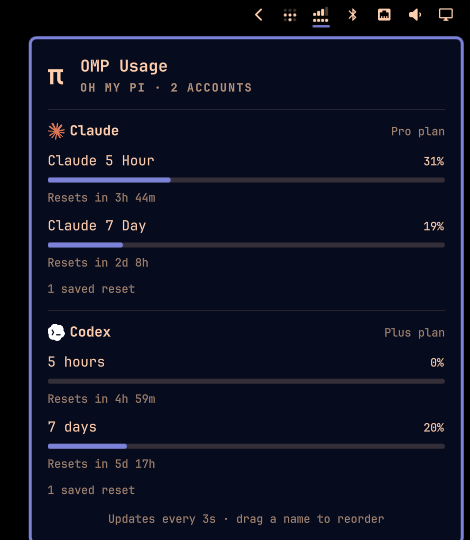

# OMP Usage

Subscription limits for every AI account logged in to [Oh My Pi](https://github.com/can1357/oh-my-pi), in the Omarchy bar.



## Features

- **Signal-bar icon.** A dual-SIM style meter: the top row of bars is your first account, the bottom row of squares is your second. More lit means more left; a row turns red at 90% used. Hover for what's left on every account.
- **Every account in one panel.** Codex, Claude, Cursor, Copilot, Gemini — whatever OMP reports — with usage bars, spend amounts, and reset times. Accounts whose provider doesn't report usage are listed with a note.
- **Exact plans.** "Plus plan", "Pro plan", "Max 20x plan" where the provider exposes it; otherwise "Subscription" or "API key".
- **Live while open.** The panel refreshes every 3 seconds; closed, it checks every 5 minutes (configurable).
- **Accounts come and go on their own.** Log in or out of an account in OMP and it appears in (or disappears from) the panel and icon within about 5 seconds.
- **Rate-limit aware.** Anthropic throttles its usage endpoint, so Claude is polled at most once a minute with backoff, and OMP's recorded usage fills the gaps. Stale data is labelled, never shown as current.
- **Drag to reorder.** Drag an account's name in the panel; the order also decides which accounts the icon shows.

## Requirements

- Omarchy with the Quickshell shell
- [Oh My Pi](https://github.com/can1357/oh-my-pi) (`omp` on `PATH`) with at least one account logged in via `/login`
- `bash`
- `sqlite3` (installed with Omarchy): used to notice account logins and logouts
- `python3` (optional): used only for exact Claude and Cursor plan names; without it those show "Subscription"

## Install

```bash
omarchy plugin add https://github.com/Mirceone/omarchy-omp-usage.git --enable
```

## Remove

```bash
omarchy plugin remove omp.usage-monitor
rm -f ~/.local/state/omarchy/omp-usage-monitor.json   # saved account order
```

## What it accesses

- Runs `omp usage --json` and `omp usage --history --json`; this is how all usage data is read.
- Every 5 seconds, reads which accounts are logged in from OMP's credential store (`~/.omp/agent/agent.db`, read-only) with `sqlite3`: only provider, credential type, and account identity, never tokens.
- `plans.py` reads OMP's credential store (read-only) to look up Claude and Cursor plan names. Each token is sent only to the provider that issued it (`api.anthropic.com`, `api2.cursor.sh` / `cursor.com`) and is never printed, logged, or stored. Lookups refuse redirects, cap responses at 1 MiB, and give up after 8 seconds in total.
- Writes only `~/.local/state/omarchy/omp-usage-monitor.json` (your account order). No other configuration is changed.

## Settings

`refreshIntervalSec` (default 300): how often usage is checked while the panel is closed.

## License

MIT
